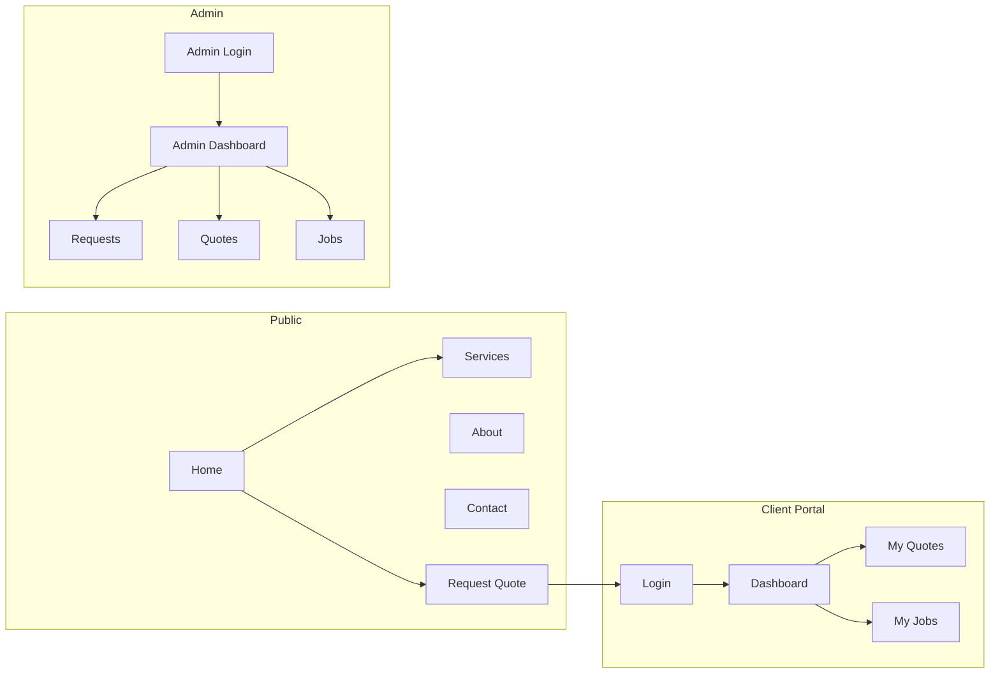

# PhilaHomes Web Application – Implementation Plan

## Goals

- **Marketing**: Home, Services (8 categories), About, Contact (map, inquiry form, social links), Portfolio (before/after gallery by service), and a step-by-step guide for requesting services.
- **Booking**: Dynamic service request form (fields by service, image upload) and a clear visual guide (stages: booking, delivery, payment).
- **Client portal**: Auth, dashboard with services overview (active/completed/pending), service pipeline (status), interactive service catalog (prices, add-ons), retired services archive, messaging with admin, quotations (view/approve), invoices (view, PDF, notifications), and online payments.
- **Admin**: Auth, manage requests, quotes, jobs, catalog, retired services, messaging, quotations, invoices, payment reconciliation, blog, analytics dashboard, and activity logs.
- **Additional**: AI chatbot for quick support; SEO (location/service keywords, blog for tips/guides); mobile-responsive layout across the app.

## Tech Stack

- **Framework**: Next.js 14+ (App Router), React, TypeScript.
- **Styling**: Tailwind CSS (brand colors as CSS variables from logo).
- **Database**: PostgreSQL or SQLite (development) via **Prisma** — one DB for users, service requests, quotes, jobs.
- **Auth**: **NextAuth.js** (credentials + optional magic link or OAuth) — separate roles: `client`, `admin`.
- **Deployment**: Vercel-friendly (serverless API routes, edge where it helps).

## Brand and Assets

- **Logo**: Use the provided PhilaHomes logo in header and footer (copy from `assets/` into `public/` e.g. `public/logo.png`).
- **Colors** (Tailwind/theme): dark blue (primary), orange (accent), yellow (highlights), grey (tagline/text), white (backgrounds).
- **Services**: All 8 categories with short descriptions and optional sub-services (e.g. Plumbing: Leak repairs, pipe installations, maintenance).

## Homepage – Frontend Features

- **Hero Banner**
  - High-quality image or video slider showcasing the breadth of services (plumbing, electrical, renovations, solar, etc.).
  - Overlay text: *"Your One-Stop Solution for Home Maintenance and Renovation."*
  - CTA buttons: **"Explore Services"** (links to `/services`) and **"Request a Quote"** (links to `/request-quote`).
  - Implement as a full-width section with overlay; use Next.js `Image` for images or a lightweight video/slider component (e.g. a few hero images with auto-rotate or manual dots).
- **Highlights Section**
  - Three key benefits displayed prominently with icons/short copy, e.g.:
    - **Certified Professionals**
    - **Affordable Pricing**
    - **Reliable Service**
  - Layout: three columns (stack on mobile); brand-aligned icons and typography.
- **Services Overview**
  - Icons and brief descriptions for each of the 8 service categories.
  - Each card/row includes a **"Learn More"** link to the corresponding `/services/[slug]` page.
  - Keeps homepage scannable while driving traffic to service detail and quote flow.
- **Customer Testimonials**
  - Carousel displaying customer reviews and ratings (e.g. star rating + quote + name/role or location).
  - Source: static config/JSON initially, or optional **Testimonial** model in DB for admin-managed reviews later.
  - Accessible carousel (keyboard, touch swipe, optional autoplay with pause control).
- **Contact Information (Footer)**
  - Address, phone number, and email clearly displayed.
  - **WhatsApp button** for instant queries (link to `https://wa.me/<number>` with optional prefill message).
  - Same footer reused across the site (Header/Footer component); consider a small "Contact" or "Get in touch" block in the footer with these details + optional minimal contact form or link to `/contact`.
- **Navigation – Services dropdown**
  - **Services** in the header is a dropdown (or hover/focus mega-menu) rather than a single link.
  - Each of the 8 primary services appears as a parent item or column, with **subcategories** listed underneath for easy navigation.
  - Example: Plumbing → Leak Repairs, Pipe Installations, Maintenance; Electrical → Wiring, Lighting, Fault Repairs; etc.
  - Subcategory links go to `/services/[slug]` with optional hash or query (e.g. `/services/plumbing#leak-repairs`) or dedicated subcategory slugs if needed.
  - Use a single services config (slug, name, subcategories) so the dropdown, services overview, and landing pages stay in sync.

## Informative Landing Pages

- **About Us** (`/about`)
  - **Mission and vision**: Clear statements of what PhilaHomes stands for and aims to achieve.
  - **Team introduction**: Short intro to the team (e.g. founder, key roles) with optional photos and bios.
  - **Certifications and affiliations**: Logos and names of industry bodies, certifications, or associations (e.g. trade bodies, quality standards) to build trust.
  - Content can be static/markdown at first; optional CMS later.
- **Contact Page** (`/contact`)
  - **Interactive map**: Embedded map with location pin (e.g. Google Maps) for PhilaHomes address.
  - **Inquiry form**: Name, Contact (email/phone), Query — submits to API (email or stored inquiries).
  - **Contact details**: Address, phone, email, WhatsApp button; business hours if desired.
  - **Social media links**: Icons/links to PhilaHomes social profiles (e.g. Facebook, Instagram, LinkedIn) in footer and/or contact section.
- **Stages for Requesting Services**
  - A **step-by-step visual guide** (e.g. on a dedicated "How it works" page or within the request-quote flow) covering: **booking** (request/quote), **service delivery** (scheduling, work in progress), and **payment** (quote approval, invoice, pay).
  - Visual steps (numbered or timeline) so clients understand the journey from request to completion.
- **Portfolio of Previous Work**
  - **Gallery** of completed projects with **before-and-after images**.
  - **Categorized by service type** (e.g. Plumbing, Electrical, Renovations) — filter or separate sections.
  - Public route (e.g. `/portfolio` or `/our-work`); optional detail page per project. Data: static at first or **Project/PortfolioItem** in DB (images, category, title, description).

## Site Structure

## Backend Features

### Client Dashboard

- **Services Overview**: Display **active services**, **completed services**, and **pending requests** in one place (tabs or sections).
- **Service Pipeline**: Status updates for ongoing services — e.g. **Requested**, **In Progress**, **Completed** (and optionally **Quoted**, **Scheduled**). Visual pipeline or list with status badges.
- **Catalog Services**: **Interactive catalog** detailing service descriptions, **prices**, and **add-ons**. Clients can browse and use it to request a quote or understand pricing. Data from DB (catalog items with base price and optional add-ons).
- **Retired Services**: **Archive** for past services no longer offered — read-only list or separate section so clients can see what was previously available.

### Communication System

- **Messaging**: **Direct messaging** between client and PhilaHomes administrator (in-app inbox in dashboard). Thread per request or one thread per client; admin replies from admin panel.
- **Automated responses**: For **FAQs** and **service status** inquiries — e.g. bot or canned replies when user asks "What is my quote status?" or common questions. Can start with simple keyword → response rules or link to help content.

### Finance Management

- **Quotations**: **Generate** (admin), **view**, and **approve** service quotes directly in the client dashboard. Approval triggers next step (e.g. create job, send invoice).
- **Invoices**: Section for **viewing invoices** (paid and unpaid). **Download PDF** invoices. **Notifications** for upcoming payments or overdue bills (email and/or in-app).
- **Payment gateway**: Integration with **online payment** options — e.g. **credit/debit cards**, **EFT**, **PayPal**, **mobile money** (provider TBD: Stripe, PayStack, or similar depending on region). Record payment status against invoice.

## Additional Features

### Interactive Tools

- **Service Request Form**
  - **Dynamic form**: Fields that change based on **selected service** (e.g. plumbing shows leak type/location; electrical shows fault type). Use a single request-quote form with conditional sections or field sets per service/sub-service.
  - **Image upload**: Option for clients to **upload images** of the issue or area needing maintenance (e.g. photos of leak, fuse box). Store in cloud storage (e.g. S3, Vercel Blob) and attach URLs to `ServiceRequest`.
- **Chatbot Integration**
  - **AI-powered assistant** for quick support (e.g. answer FAQs, explain services, help with request status). Can use a third-party widget (e.g. OpenAI API behind a simple chat UI, or Crisp/Intercom with AI). Optional: hand off to human (admin) when needed.

### Analytics Dashboard (Admin)

- **Overview**: Metrics for **services** (requests/quotes/jobs by category), **active users** (registered, recent activity), and **revenue trends** (payments over time, by service). Charts/tables on admin home or dedicated `/admin/analytics`.
- **Activity logs**: **Logs for user activities** — e.g. requests created, messages sent, logins, quote views. Store in **ActivityLog** (userId, action, entityType, entityId, metadata, createdAt). Admin view at `/admin/logs` with filters (user, action, date).

### SEO Optimization

- **Location and service keywords**: Use **keywords** specific to location and services (e.g. "affordable plumbing in Johannesburg", "solar PV installation [city]"). Implement via meta tags, titles, and content on service pages and homepage (Next.js metadata API, optional `sitemap.xml` and `robots.txt`).
- **Blog section**: **Blog** for tips and guides (e.g. "How to Maintain Your Solar PV System", "When to Call a Plumber"). Public route `/blog` and `/blog/[slug]`; content in DB (**Post**: title, slug, excerpt, body, publishedAt, category/tags) or markdown. Helps SEO and positions PhilaHomes as experts.

### Mobile Responsiveness

- **Fully optimized** for **mobile and tablet** devices: responsive layout (Tailwind breakpoints), touch-friendly nav (e.g. hamburger menu), readable typography, tap targets, and tested forms/tables on small screens. Apply across all public pages, dashboard, and admin.

## Data Model (Prisma)

- **User**: id, email, passwordHash, name, role (`client` | `admin`), createdAt.
- **ServiceRequest** (booking/quote request): id, userId (optional for anonymous), serviceCategory, subService (optional), description, contactName, contactEmail, contactPhone, status, **imageUrls** (array of uploaded image URLs), createdAt.
- **Quote**: id, requestId, amount (optional), notes, status (`draft` | `sent` | `accepted` | `declined`), createdAt.
- **Job**: id, quoteId, requestId, status (`scheduled` | `in_progress` | `completed`), scheduledDate, completedAt, notes.

Relations: ServiceRequest → Quote (one-to-one or one-to-many), Quote → Job (one-to-one).

- **Testimonial** (optional, for admin-managed homepage carousel): id, authorName, roleOrLocation, quote, rating (1–5), isVisible, order, createdAt.
- **CatalogItem** (service catalog): id, serviceCategory/slug, name, description, basePrice, isRetired, order, createdAt. **AddOn** (optional): id, catalogItemId, name, price.
- **PortfolioItem** (portfolio gallery): id, title, description, serviceCategory, imageUrls (before/after or gallery), order, isVisible, createdAt.
- **Message** / **Conversation**: id, userId, adminId (optional), requestId or quoteId (optional), createdAt. **Message**: id, conversationId, senderRole (client|admin), body, createdAt. Enables client–admin messaging.
- **Invoice**: id, quoteId or jobId, userId, amount, status (draft|sent|paid|overdue), dueDate, paidAt, pdfUrl (optional), createdAt.
- **Payment**: id, invoiceId, amount, method (card|eft|paypal|mobile_money), externalId, status, createdAt.
- **ActivityLog**: id, userId (optional), action (e.g. request_created, message_sent, login), entityType, entityId, metadata (JSON), createdAt. For admin activity logs.
- **Post** (blog): id, title, slug, excerpt, body, publishedAt, category/tags (optional), createdAt. For SEO and tips/guides.

## Pages and Routes (App Router)

| Route                        | Purpose                                                                                                                              |
| ---------------------------- | ------------------------------------------------------------------------------------------------------------------------------------ |
| `/`                          | Home: hero, featured services, CTA to request quote, trust/contact snippet                                                           |
| `/services`                  | List all 8 categories with short descriptions and links to request quote                                                             |
| `/services/[slug]`           | Single service page (e.g. plumbing, electrical) with detail, subcategories, and "Request quote" CTA                                    |
| `/about`                     | Mission, vision, team introduction, certifications and affiliations with industry bodies                                             |
| `/contact`                   | Interactive map with location pin; inquiry form (Name, Contact, Query); contact details; social media links                        |
| `/how-it-works`              | Step-by-step visual guide: booking → service delivery → payment                                                                      |
| `/portfolio`                 | Gallery of completed projects (before/after), categorized by service type                                                            |
| `/blog`                      | Blog listing: tips and guides (e.g. solar PV maintenance); SEO-focused content                                                       |
| `/blog/[slug]`               | Single blog post                                                                                                                     |
| `/quote` or `/request-quote` | Dynamic service request form (fields vary by service); image upload for issue/area; category, description, contact; optional account |
| `/login`                     | Sign in (clients and admin; redirect by role)                                                                                        |
| `/register`                  | Client registration only                                                                                                             |
| `/dashboard`                 | Services overview (active/completed/pending), service pipeline (status), catalog, retired services, messages, quotes, invoices       |
| `/dashboard/catalog`         | Interactive catalog: service descriptions, prices, add-ons                                                                             |
| `/dashboard/messages`       | Direct messaging with PhilaHomes admin; automated FAQ/status responses                                                               |
| `/dashboard/quotes/[id]`     | View quote; approve/reject                                                                                                           |
| `/dashboard/invoices`       | List invoices (paid/unpaid); download PDF; payment due/overdue notifications                                                        |
| `/dashboard/jobs/[id]`       | View job status and details                                                                                                          |
| `/admin`                     | Overview of requests, quotes, jobs, catalog, messages, invoices                                                                      |
| `/admin/requests`            | List and filter service requests; link to create quote                                                                               |
| `/admin/quotes`              | List quotes; create/edit quote (amount, notes, status)                                                                               |
| `/admin/jobs`                | List jobs; update status and notes                                                                                                    |
| `/admin/catalog`             | Manage catalog items (prices, add-ons); mark retired services                                                                        |
| `/admin/messages`            | View and reply to client conversations                                                                                               |
| `/admin/invoices`            | Create/send invoices; record payments; PDF generation                                                                                 |
| `/admin/analytics`           | Overview: services metrics, active users, revenue trends; charts/tables                                                              |
| `/admin/logs`                | Activity logs: filter by user, action, date (requests, messages, logins)                                                             |
| `/admin/blog`                | Create/edit/publish blog posts (tips and guides)                                                                                      |

## Key Implementation Details

1. **Next.js app**: `app/` with `layout.tsx` (root layout with header/footer and logo), `page.tsx` for home, and route groups if desired (e.g. `(marketing)`, `(dashboard)`, `(admin)`).
2. **Header/Footer**: Shared components using logo from `/logo.png`. Nav: Home; **Services** as a dropdown with subcategories under each of the 8 primary services (from shared config); About; Contact; Request Quote; Dashboard when client; Admin when admin. Footer: address, phone, email, WhatsApp; same on all pages.
3. **Auth**: NextAuth with Credentials provider; session role used for redirects and middleware. Middleware protects `/dashboard/*` (client) and `/admin/*` (admin).
4. **Quote flow**: **Dynamic** request form — fields change by selected service (config-driven or conditional components). **Image upload** for issue/area (multipart to API; store in Vercel Blob or S3; save URLs on `ServiceRequest`). Form creates `ServiceRequest` (and optionally `User` + link if they register). Optionally send confirmation email (e.g. Resend) and show success + "View in dashboard" if logged in.
5. **Admin flows**: Create `Quote` from a `ServiceRequest`; create `Job` from accepted quote; manage catalog (CRUD, retired flag); reply to messages; create/send invoices; record payments; manage blog posts; view analytics and logs.
6. **Client dashboard**: Services overview (active/completed/pending) and pipeline (Requested → In Progress → Completed); catalog view (prices, add-ons) and retired archive; messaging inbox with admin; view/approve quotes; view invoices and download PDF; pay via gateway (Stripe/PayStack/etc.).
7. **Communication**: Messages stored in DB; admin UI to reply; optional FAQ/status auto-responses (keyword rules or links to help).
8. **Finance**: Invoices linked to quote/job; PDF generation (e.g. react-pdf or server-side); payment gateway webhook to update invoice status; email/in-app notifications for due and overdue.
9. **Chatbot**: AI-powered assistant (e.g. OpenAI API or widget) for FAQs and support; optional handoff to admin. Can sit in corner widget on public/dashboard pages.
10. **Analytics & logs**: Admin analytics page — aggregate queries for services, users, revenue; ActivityLog written on key actions (request, message, login, etc.); admin logs page with filters.
11. **SEO**: Next.js metadata (title, description) per page; location + service keywords (e.g. "affordable plumbing Johannesburg"); sitemap/robots; blog for long-tail content.
12. **Blog**: Post model; admin CRUD; public `/blog` and `/blog/[slug]` with server render for SEO.
13. **Mobile**: Responsive layout (Tailwind), hamburger nav, touch-friendly controls; test key flows on mobile/tablet.

## File and Folder Sketch

- `app/layout.tsx`, `app/page.tsx`, `app/globals.css`
- `app/(marketing)/services/page.tsx`, `app/(marketing)/services/[slug]/page.tsx`, `app/(marketing)/about/page.tsx`, `app/(marketing)/contact/page.tsx`
- `app/request-quote/page.tsx`, `app/login/page.tsx`, `app/register/page.tsx`
- `app/how-it-works/page.tsx`, `app/portfolio/page.tsx` (and optional `app/portfolio/[category]/page.tsx`)
- `app/blog/page.tsx`, `app/blog/[slug]/page.tsx`
- `app/dashboard/layout.tsx`, `app/dashboard/page.tsx`, `app/dashboard/catalog/page.tsx`, `app/dashboard/messages/page.tsx`, `app/dashboard/invoices/page.tsx`, `app/dashboard/quotes/[id]/page.tsx`, `app/dashboard/jobs/[id]/page.tsx`
- `app/admin/layout.tsx`, `app/admin/page.tsx`, `app/admin/requests/page.tsx`, `app/admin/quotes/page.tsx`, `app/admin/jobs/page.tsx`, `app/admin/catalog/page.tsx`, `app/admin/messages/page.tsx`, `app/admin/invoices/page.tsx`, `app/admin/analytics/page.tsx`, `app/admin/logs/page.tsx`, `app/admin/blog/page.tsx` (and post edit)
- `app/api/auth/[...nextauth]/route.ts`, `app/api/upload/route.ts` (images for service request), `app/api/chat/route.ts` (chatbot, optional), `app/api/requests/route.ts`, `app/api/quotes/route.ts`, `app/api/jobs/route.ts`, `app/api/catalog/route.ts`, `app/api/messages/route.ts`, `app/api/invoices/route.ts`, `app/api/payments/route.ts` (and webhook for gateway), `app/api/posts/route.ts` (blog), `app/api/analytics/route.ts` (admin)
- `components/ui/` (buttons, inputs, cards), `components/layout/Header.tsx` (with Services dropdown; mobile hamburger), `components/layout/Footer.tsx` (address, phone, email, WhatsApp, social), `components/forms/QuoteRequestForm.tsx` (dynamic fields + image upload), `components/forms/ContactForm.tsx`, `components/chat/Chatbot.tsx` (optional)
- Shared config: `lib/services.ts` or `data/services.ts` — list of 8 services with slug, name, subcategories (for nav dropdown, services overview, and landing pages)
- Homepage sections: `components/home/HeroBanner.tsx`, `components/home/HighlightsSection.tsx`, `components/home/ServicesOverview.tsx`, `components/home/TestimonialsCarousel.tsx` (data from config or API)
- `components/contact/ContactMap.tsx`, `components/portfolio/PortfolioGallery.tsx`, `components/how-it-works/StagesGuide.tsx`
- Footer: add social media links component
- `lib/prisma.ts`, `lib/auth.ts`, `prisma/schema.prisma`
- Invoice PDF: e.g. `lib/pdf/invoice.ts` or use react-pdf / server-side PDF lib
- `public/logo.png` (PhilaHomes logo)

## Phasing Suggestion

- **Phase 1**: Next.js + Tailwind + Prisma schema; **mobile-responsive** layout (hamburger nav, breakpoints); homepage (hero, highlights, services overview, testimonials); footer (address, phone, email, WhatsApp, social links); services list + dropdown; about; contact (map, inquiry form, social links); how-it-works (stages); portfolio gallery (static or DB). **SEO**: metadata, location/service keywords, sitemap/robots.
- **Phase 2**: **Dynamic** request-quote form (fields by service) + **image upload** (API + storage); store requests; optional email. Catalog data model and admin CRUD for catalog + retired services; client catalog view. **Blog**: Post model, admin create/edit, public `/blog` and `/blog/[slug]`.
- **Phase 3**: NextAuth (register + login); client dashboard — services overview, pipeline, catalog, retired archive; view/approve quotes; view jobs. Admin: requests, quotes, jobs, catalog. **ActivityLog** and **admin logs** page; **admin analytics** (services, users, revenue).
- **Phase 4**: Messaging (client–admin threads, admin replies; optional FAQ/status auto-responses). Invoices: create/send, PDF download, list paid/unpaid; notifications for due/overdue. **Chatbot** (AI assistant) for quick support.
- **Phase 5**: Payment gateway integration (cards, EFT, PayPal, mobile money); record payments; update invoice status; optional email receipts.

## Out of Scope (for later)

- Calendar/scheduling UI for job dates (start with date + status only).
- Rich CMS for About/services copy (static or markdown initially).
- Full native mobile app (responsive web covers mobile/tablet).

---

This plan gives you a single codebase (Next.js), one database (Prisma), and clear separation between public site, client area, and admin, aligned with the PhilaHomes logo and the eight service categories.
